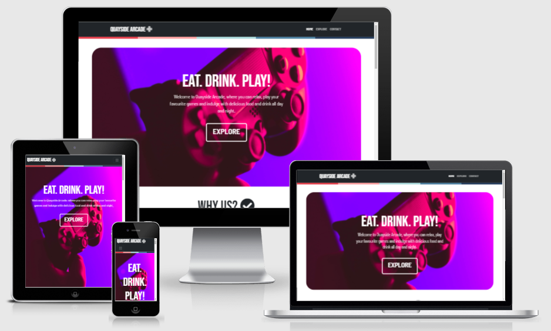
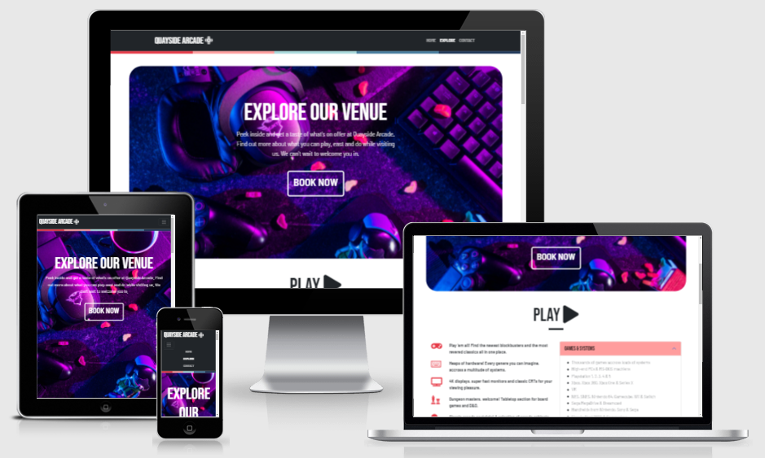
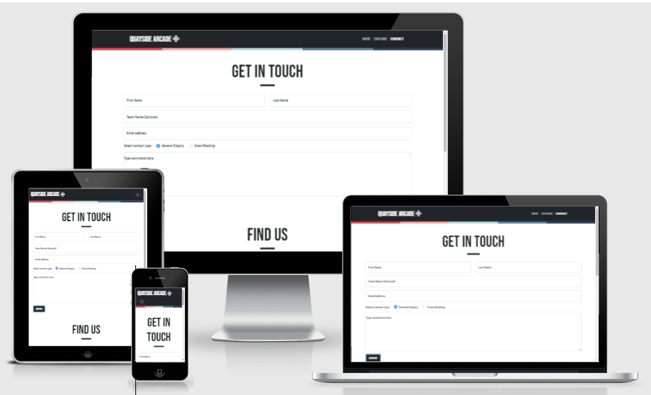

# Quayside Arcade

## Table of Contents
  * [Milestone Project One](#milestone-project-one)
  * [Live Project](#live-project)
  * [Screenshots](#screenshots)
    + [Home page screenshot](#home-page-screenshot)
    + [Explore page screenshot](#explore-page-screenshot)
    + [Contact page screenshot](#contact-page-screenshot)
  * [User Experience (UX)](#user-experience--ux-)
  * [User Experience (UX)](#user-experience--ux--1)
    + [Target Audience](#target-audience)
    + [User journey](#user-journey)
    + [User stories](#user-stories)
      - [New Visitor Goals](#new-visitor-goals)
      - [Returning Visitor Goals](#returning-visitor-goals)
      - [Booked Visitor Goals](#booked-visitor-goals)
    + [Design](#design)
      - [Colour Scheme](#colour-scheme)
      - [Typography](#typography)
      - [Imagery](#imagery)
    + [Wireframes](#wireframes)
  * [Features](#features)
    + [Features to implement in the future](#features-to-implement-in-the-future)
    + [Technologies / Libraries / Programs](#technologies---libraries---programs)
  * [Testing](#testing)
    + [Target audience appeal](#target-audience-appeal)
    + [User journey](#user-journey-1)
    + [User Stories](#user-stories)
    + [First time visitor goals](#first-time-visitor-goals)
    + [Returning Visitor Goals](#returning-visitor-goals-1)
    + [Booked Visitor Goals](#booked-visitor-goals-1)
    + [Testing the code](#testing-the-code)
      - [Bug examples](#bug-examples)
      - [Existing bugs](#existing-bugs)
  * [Setup, Backups & Depoyment](#setup--backups---depoyment)
  * [Credits](#credits)
    + [Bootstrap 5 components used](#bootstrap-5-components-used)
    + [Documentation & Online Help](#documentation---online-help)
    + [Media](#media)
    + [Content](#content)
    + [Acknowledgements](#acknowledgements)

<small><i><a href='http://ecotrust-canada.github.io/markdown-toc/'>Table of contents generated with markdown-toc</a></i></small>

## Milestone Project One
- This project tasked me with creating a static website with three pages using front end technologies. Additionally, content should be justified, functional, presented logically, accessible and responsive.
- Quayside Arcade is a fictional modern arcade/bar/cafe, and a project which I have created to display and test front end abilities. HTML, CSS and Bootstrap were primarilly used, along with other tools which will be outlined in this ReadMe.
- The website consists of three main pages, with some page section link functionality also used for easier navigation. A home page gives users a quick overview of the business offerings, and returning visitors quick access to upcoming events. For customers who would like to explore further, an 'explore' page goes into greater depth of the business offerings. Finally, a contact page provides users with contact and address information.

## Live Project
[View the live project here.](https://shepuk.github.io/CIPROJECT1-QUAYSIDE-ARCADE/)

## Screenshots

### Home page screenshot

### Explore page screenshot

### Contact page screenshot

## User Experience (UX)

-   ### Target Audience
    - The target audience for the website would be clients interested in gaming and geek culture, or exclusively the bar/cafe portion of the business. Because of this the target audience is wide-ranging, but the largest portion of the target audience would be young people aged teens to adults around the age of 35.
-   ### User journey
    - I would like to guide the user through the website naturally with well-placed buttons and an easy to follow flow of information. A typical user should be easily able to start at the home page, explore various features of the business and finally end up at the contact page.
-   ### User stories
    -   #### New Visitor Goals
        1. As a new visitor, I want to find information on what the venue does and what it has to offer me.
        2. As a new visitor, I want to look at images and see what it's like inside the business.
        3. As a new visitor, I want to find out about any upcoming events to spectate or sign up.
        4. As a new visitor, I would like to see menu and pricing options.
    -   #### Returning Visitor Goals
        1. As a Returning Visitor, I want to check on upcoming events to spectate or sign up if desired.
        2. As a Returning Visitor, I want to find contact details for the organisation.
    -   #### Booked Visitor Goals
        1. As a Booked Visitor, I want to find directions to the venue.
        2. As a booked Visitor, I want to find info and pricing on food and drinks.

-  ### Design
    -   #### Colour Scheme
        -   I used the color palette tool [Coolors](https://coolors.co/) to find a pleasing set of colours to use in the design of the website. The main colours used are: #e63946, #ff9d9d, #a8dadc, #457b9d, #1d3557 & #212529
        - Pale colours alongside dark or bright text allowed a good level of contrast between text and images for better accessiblilty. 
    -   #### Typography
        -   Bebas Neue and Barlow Semi Condensed fonts are the main fonts used throughout the website with Sans Serif as the fallback font. These custom fonts are modern, readable and pleasing to the eye, making the website more enjoyable as a result. Fonts were imported from [Google Fonts.](https://fonts.google.com/)
        - Using a range of styling and font weights gives good variety throughout the website while only using two fonts. 
        - For navbar links, I used a subtle scale increase and brightness increase hover effect to make it obvious that the text is a link. High-contrast buttons were used elsewhere for clear navigation.
        - [Font Awesome](https://fontawesome.com/) icons are used throughout the website design to provide emphasis, aesthetic value and clear labeling for the user. 
    -   #### Imagery
        - Large hero images are used to catch attention and guide the user to the next webpage - naturally stepping through the user journey.
        - Other images are used throughout and act responsively. A gallery section showcases an inviting venue. Images of food and drinks accompany descriptions of a bar/cafe area for reference. 
        -   Various stock imagery has been used througout the website. I was careful to choose images which complemented the design/ font/ colour scheme of my website. Stock photos are sourced from [Pexels](https://www.pexels.com/) and [Unsplash](https://unsplash.com/).

- ### Wireframes
    - View wireframe [here](https://github.com/shepuk/CIPROJECT1-QUAYSIDE-ARCADE/blob/main/assets/images/wireframe/wireframe.png)
    - Initial wireframes were designed to provide a basic layout and structure when going into the project. As you can see from the image, my biggest change is probably the scope of the overall design. After a re-evaluation of my available time, I changed from four pages to three in order to ensure a higher overall quality in design and UX. 

## Features
-   The website has been designed with responsiveness in mind at all times. Not only do elements responsively and dynamically move around the page to suit different viewports, but my design is actively updated as well. For example, hero sections change to a full screen design on smaller devices and remove all margins as this looks much better on phone screens.
- The website is interactive and provides great feedback to the user. Starting with the navbar, links scale and change colour when hovered over. The navbar updates to a dropdown on smaller devices. Buttons throughout the website animate and change colour when hovered over.
- In interactive Google Map is implemented via iframe.
- The contact form animates when clicked and filled in.

### Features to implement in the future
- I would like to return to this project and add an event booking feature. This would allow users to select an event, enter their details and be enrolled in one of the advertised events. 

### Technologies / Libraries / Programs
- [HTML5](https://en.wikipedia.org/wiki/HTML5) provided the main structure of the page.
- [CSS3](https://en.wikipedia.org/wiki/Cascading_Style_Sheets) allowed me to style elements of the website, and also customize Bootstrap styling.
- [Bootstrap 5](https://getbootstrap.com/) was used throughout the project for its modern and responsive layouts. Navbar, forms, grid and accordion were the main components used.
- [jQuery](https://jquery.com/) is used with Bootstrap to provide the responsive navbar.
- [Font Awesome](https://fontawesome.com/) provided several icons to help make the website look more attractive and give text more emphasis.
- [Google Fonts](https://fonts.google.com/) was used to import two fonts into the project; Bebas Neue for headings and titles, and Barlow Semi Condensed for other text. 
- [Git](https://git-scm.com/) was used via the terminal for version control.
- [Github](https://github.com/) was used to host and store the project files.
- [Gitpod](https://www.gitpod.io/) was my primary IDE during project development. The VSCode likeliness helped to provide a familiar working environment.
- [Balsamiq](https://balsamiq.com/) was used to create wireframes for the project.
- [Coolors](https://coolors.co/) is a palette tool which groups complimentary colours together and was used to select my main website colours.
- [Am I Responsive](http://ami.responsivedesign.is/) is a tool which allowed me to see and show pages of the website in different screen sizes.
- [CopyPaste CSS](https://copy-paste-css.com/) was used when picking an appropriate animation for button.

## Testing

### Target audience appeal
- I tried to appeal to the target audience by adopting a modern design. This included stylish fonts and icons, rounded corners and modern language. By sticking to this styling, the website is eye-catching and appealing to the target demographic, while retaining ease of navigartion and good accesibility.

### User journey
- The intended user journey of home > explore > contact is executed well thanks to a logical flow of information and large, striking call-to-action buttons placed in the hero section of pages. Clear signposting is provided to the user so they know where to navigate next. This does not distract from standard clear navigation menus or buttons, however, as these are also displayed clearly for maximum ease of navigation.

### User Stories
A mixture of manual and validator testing was performed on the website throughout development and after completion. Manually testing user cases as outlined in the initial brief was important and is outlined below. I tested the website in Chrome, Firefox, Edge, Internet Explorer and Safari browsers, as well as large and small computer displays and mobile phones. All links on all pages were tested. Some testing was performed by friends and colleagues, such as general user-friendliness and link testing, to provide a fresh perspective after I had been working on the project alone for some time.

- ### First time visitor goals
    1. As a new visitor, I want to find information on what the venue does and what it has to offer me.
        - The business features are made immidiately apparent to the user with a short but descriptive hero section, followed by a grid list of products and services. 
        - A clean navigation style helps the user to browse the website easily and strong headings provide strong context. A natural flow through the website is provided by large 'call to action' buttons in the hero headings, with the goal of eventually leading the user to the booking page.
    2. As a new visitor, I want to look at images and see what it's like inside the business.
        - A gallery is provided on the home page which invites the user to see inside the building and provide visual descriptions of what they can expect when visiting.
    3. As a new visitor, I want to find out about any upcoming events to spectate or sign up.
        - A row of cards shows upcoming events clearly. This is on the home page, and also linked back to via the explore page. Booking instructions are provided clearly underneath the event listings so that the user knows how to book if desired.
    4. As a new visitor, I would like to see menu and pricing options.
        - As part of the user journey, users will eventually be directed to the appropriate section to find out more about the eating and drinking options. Of course, for users seeking this information out specifically, headings are clear and the desired section is easy to find. 
        - PDF food and drinks menus can be viewed and downloaded by the user, with contain details and pricing for various products.

- ### Returning Visitor Goals
    1. As a Returning Visitor, I want to check on upcoming events to spectate or sign up if desired.
        - The event listings are provided on the home page, for very quick access to users who wish to view this specifically.
        - Again, a row of cards shows upcoming events clearly. This is on the home page, and also linked back to via the explore page. Booking instructions are provided clearly underneath the event listings so that the user knows how to book if desired.
    2. As a Returning Visitor, I want to find contact details for the organisation.
        - Conforming to widely accepted user experience giudelines, a dedicated contact page is linked in the navigatoin bar at the top of each page. The contact form is shirt and only asks for necessary information from the user. After filling out the form, the page reloads to confirm to the user that the information has been sent to the business. 

- ### Booked Visitor Goals
    1. As a Booked Visitor, I want to find directions to the venue.
        - An address and map are provided on the contact page so that the user can easily find their way to the venue.
    2. As a booked Visitor, I want to find info and pricing on food and drinks.
        - As part of the user journey, users will eventually be directed to the appropriate section to find out more about the eating and drinking options. Of course, for users seeking this information out specifically, headings are clear and the desired section is easy to find. 
        - PDF food and drinks menus can be viewed and downloaded by the user, with contain details and pricing for various products.

### Testing the code
Throughout the project, I used the W3C validator tools to find and fix various typos or errors in my code.
-   [W3C Markup Validator](https://jigsaw.w3.org/css-validator/#validate_by_input)
-   [W3C CSS Validator](https://jigsaw.w3.org/css-validator/#validate_by_input)

- [Home page validator resuls](https://github.com/shepuk/CIPROJECT1-QUAYSIDE-ARCADE/blob/main/assets/images/validator-results/homeresults.png)
- [Explore page validator results](https://github.com/shepuk/CIPROJECT1-QUAYSIDE-ARCADE/blob/main/assets/images/validator-results/exploreresults.png)
- [Contact page validator results](https://github.com/shepuk/CIPROJECT1-QUAYSIDE-ARCADE/blob/main/assets/images/validator-results/contactresults.png)
- [CSS file validator results](https://github.com/shepuk/CIPROJECT1-QUAYSIDE-ARCADE/blob/main/assets/images/validator-results/cssresults.png)

#### Bug examples
1. I ran into issues when trying to center some text placed inside the hero heading button. 
    - This was resolved by removing the parent div of the p element and directly center aligning the p element instead.
2. Link hover animations were not displaying correctly when the navbar was in it's collapsed mobile state. To resolve this I needed to center the links in the dropdown menu, however Bootstrap's styling made this difficult.
    - After some troubleshooting, I searched online and found a StackOverflow post detailing a similar issue. After applying the fix the animations appeared correctly.
3. In mobile views when some hero section media queries take effect, some horizontal scrolling was activated, creating unwanted overflow of the hero image, behind the scrollbar.
    - I found the fix for this to be related to my CSS styling. I altered the media query to update the hero image to 100% width rather than 100vw width to resolve this.
4. After deploying the files to Github pages, many links broke and directed to a Github 404 page.
    - This was easily fixable by slightly changing the links within my HTML code into a format which Github pages was compatible with. In all cases, this involved removing a forwardslash from the beginning of the link. This also prompted me to add my own 404 page.

#### Existing bugs
1. Contact page - Comment box placeholder text is not aligned in line with other input boxes.
2. Internet Explorer browser has various issues mainly involving elements using JavaScript. Small amounts of CSS code is also not compatible in IE.

## Setup, Backups & Depoyment
[Gitpod](https://www.gitpod.io/) was used as my primary IDE.
A template was provided by Code Institute which I cloned for my project repository.
Opening the repository in Gitpod is made simple thanks to a [Chrome Extension](https://chrome.google.com/webstore/detail/gitpod-always-ready-to-co/dodmmooeoklaejobgleioelladacbeki).
index.html and other files & folders were created via a combination of terminal commands and GUI shortcuts.

Git / Github were used for file versioning and hosting.
git add . was used initial to add my files and folders to the staging area, followed by git commit -m "Initial commit" and git push to finally add them to my Github repository.
Throughout the project, I was careful to use Git often and tried to make commits as descriptive as possible as well.

Once completed, I used Github pages to host the website.
This was done via the following steps;
- Go to the repository you wish to add to Github pages.
- Select the settings option
- Slect pages in the left column
- Select the master branch and /root folder
- Click Save
- The link will appear after the page refreshes and the website will now be live.

## Credits

### Bootstrap 5 components used
[Grid](https://getbootstrap.com/docs/5.0/layout/grid/) was used on all pages of the website for it responsive design.
[Accordion](https://getbootstrap.com/docs/5.0/components/accordion/) was used on the explore page to group some text together.
[Buttons](https://getbootstrap.com/docs/5.0/components/buttons/) were used throughout the website to link the user back and forth.
[Cards](https://getbootstrap.com/docs/5.0/components/card/) were used in places as they provided some additional styling over the normal grid.
[Navbar](https://getbootstrap.com/docs/5.0/components/navs-tabs/) was heavily customised and used at the top of every page.

### Documentation & Online Help
[Mozilla MDN](https://developer.mozilla.org/en-US/docs/Web/CSS/column-count) for Gallery design (column-count).
[StackOverflow](https://stackoverflow.com/questions/17348108/css-stripe-with-multiple-colors) for a method of filling a div with multiple colours.
[StackOverflow](https://stackoverflow.com/questions/18777235/center-content-in-responsive-bootstrap-navbar) again was used when finding a solution to center navbar items in mobile view.
[W3 Schools](https://www.w3schools.com/) with help on various syntax, standards and best practice queries.
[CopyPaste CSS](https://copy-paste-css.com/) was used to help animate the hero section buttons.

### Media
[Pexels](https://www.pexels.com/) and [UnSplash](https://unsplash.com/) were used for their royalty-free imagery.

### Content
All content was written by me.

### Acknowledgements
Code Institute & Newcastle College for their support.